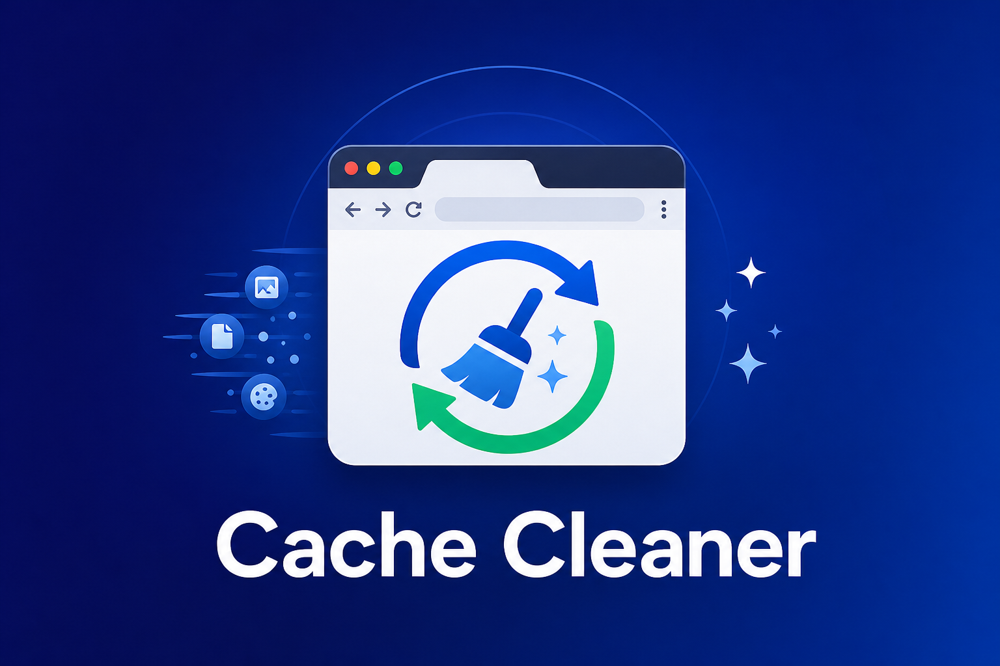

<div align="center">

**Extensão Chrome para limpar cache do navegador em qualquer site**

[](https://developer.chrome.com/docs/extensions/)
[](https://developer.chrome.com/docs/extensions/develop/migrate)
[](https://developer.mozilla.org/en-US/docs/Web/JavaScript)
[](https://developer.mozilla.org/)

</div>

# 🧹 Cache Cleaner

## 📖 Sobre o Projeto

Extensão para Google Chrome que agiliza a limpeza de cache do navegador em **qualquer site**. Útil quando a página não reflete alterações recentes por cache HTTP, Cache Storage, service workers ou requisições antigas.

---

## 🎯 Para que serve

Durante desenvolvimento, testes ou suporte, é comum um site exibir conteúdo desatualizado. Esta extensão automatiza a limpeza de cache **na aba ativa**: remove os dados em cache do domínio atual, executa a ação escolhida e **mantém você na mesma página**.

---

## ⚡ Funcionalidades

| Botão | Descrição | O que faz |
|---|---|---|
| **Site** | Cache HTTP e storage do domínio | Limpa cache HTTP, Cache Storage e service workers do domínio da aba ativa e recarrega a página. |
| **Reload** | Cache do navegador | Limpa o cache do site, retorna para a URL original e executa um hard reload (com bypass de cache). |
| **Bypass** | Atualizar versão | Limpa o cache do site e recarrega a página com o parâmetro `?nocache=timestamp`. |
| **Limpeza Completa** | Site, navegador e bypass | Executa a limpeza em sequência: cache do site, bypass de versão e hard reload. |

### O que é limpo

Para o **domínio da aba ativa** (`origin`), a extensão remove:

- **HTTP cache** — respostas em cache do navegador
- **Cache Storage** — dados da Cache API
- **Service workers** — workers registrados no domínio

**Não** são removidos cookies, `localStorage`, `sessionStorage`, IndexedDB nem cache de servidor/CDN.

### Fluxo comum (todos os botões)

1. Identifica a URL e o domínio da aba ativa
2. Remove cache HTTP, Cache Storage e service workers do domínio via `chrome.browsingData`
3. Recarrega ou navega para a URL original (com ou sem `?nocache`, conforme o botão)
4. Aplica hard reload, quando aplicável

---

## 📋 Requisitos

### Navegador

A extensão foi desenvolvida para **Google Chrome** e funciona sem alterações em navegadores **baseados em Chromium**, como:

- Google Chrome
- Microsoft Edge
- Brave
- Opera

### Demais requisitos

- Estar com uma aba aberta em uma URL **HTTP ou HTTPS**
- Páginas internas do navegador (`chrome://`, `about:`, etc.) não são suportadas

---

## 📄 Página de documentação

Após ativar o GitHub Pages, a documentação fica disponível em:

**https://williamtechqa.github.io/myapp-cache-cleaner/**

Para ativar: no repositório, vá em **Settings → Pages → Source: Deploy from branch → main → /docs**.

---

## 🚀 Instalação

### 1️⃣ Baixar o projeto

Clone o repositório ou baixe o ZIP:

```bash
git clone https://github.com/WilliamTechQa/myapp-cache-cleaner.git
```

### 2️⃣ Carregar no Chrome

1. Abra `chrome://extensions`
2. Ative **Modo do desenvolvedor** (canto superior direito)
3. Clique em **Carregar sem compactação**
4. Selecione a pasta do projeto
5. A extensão **Cache Cleaner** aparecerá na barra de ferramentas

### 3️⃣ Fixar na barra (opcional)

Clique no ícone de quebra-cabeça na barra do Chrome e fixe o **Cache Cleaner** para acesso rápido.

---

## 💡 Como usar

1. Abra a página que deseja testar
2. Clique no ícone da extensão na barra do Chrome
3. Escolha a ação no menu:

| Situação | Botão recomendado |
|---|---|
| A página parece servir conteúdo em cache local | **Site** |
| Arquivos estáticos (CSS/JS) parecem desatualizados | **Reload** |
| Quer forçar uma nova requisição sem alterar a lógica da página | **Bypass** |
| Não tem certeza ou quer garantir tudo | **Limpeza Completa** |

> **Dica:** O popup pode fechar durante a execução. As ações continuam na aba em segundo plano.

---

## 📁 Estrutura do projeto

```
myapp-cache-cleaner/
├── manifest.json    # Configuração da extensão (Manifest V3)
├── popup.html       # Interface do menu
├── popup.js         # Lógica de limpeza de cache
├── style.css        # Estilos do popup
├── icon-16.png      # Ícones da extensão
├── icon-32.png
├── icon-48.png
├── icon-128.png
└── docs/            # Documentação (GitHub Pages)
```

---

## 🔐 Permissões

| Permissão | Motivo |
|---|---|
| `tabs` | Ler a aba ativa, navegar e recarregar com bypass de cache |
| `browsingData` | Remover cache HTTP, Cache Storage e service workers por domínio |
| `<all_urls>` (host) | Permitir limpeza de cache em qualquer site visitado |

---

## ❓ FAQ

### A extensão funciona em qualquer site?

Sim, desde que a aba ativa esteja em uma URL `http://` ou `https://`. A limpeza afeta **apenas o domínio da aba atual**.

### Cliquei no botão e nada pareceu acontecer

Verifique se a aba ativa não é uma página interna do navegador (`chrome://`, `about:`, etc.). O popup pode fechar após o clique, mas a página deve recarregar automaticamente.

### Ainda vejo conteúdo antigo depois da limpeza

Tente **Limpeza Completa**. Se persistir, pode ser cache de CDN, sessão do usuário, dados no servidor ou outro fator fora do escopo desta extensão.

### A extensão desloga o usuário?

Não. Cookies, `localStorage` e `sessionStorage` **não** são removidos por padrão.

---

## 🛠️ Tecnologias

- Chrome Extension Manifest V3
- HTML, CSS e JavaScript (vanilla)
- Chrome Tabs API
- Chrome Browsing Data API

---

## 📜 Licença

Uso livre para fins pessoais e profissionais.

---

## 🇺🇸 English

Chrome extension that speeds up browser cache cleanup on **any site**. Useful when a page shows stale content due to HTTP cache, Cache Storage, service workers, or old requests.

### What it does

Clears cache data for the **active tab's domain** and runs the action you choose — keeping you on the same page.

| Button | What it does |
|---|---|
| **Site** | Clears HTTP cache, Cache Storage, and service workers for the active domain, then reloads. |
| **Reload** | Clears site cache, returns to the original URL, and performs a hard reload (cache bypass). |
| **Bypass** | Clears site cache and reloads with a `?nocache=timestamp` query parameter. |
| **Full Cleanup** | Runs all three steps in sequence. |

Cookies, `localStorage`, and `sessionStorage` are **not** removed.

### Requirements

- Google Chrome or any **Chromium-based** browser (Edge, Brave, Opera)
- An active tab on an **HTTP or HTTPS** URL (internal pages like `chrome://` are not supported)

### Installation

```bash
git clone https://github.com/WilliamTechQa/myapp-cache-cleaner.git
```

1. Open `chrome://extensions`
2. Enable **Developer mode**
3. Click **Load unpacked**
4. Select the project folder

### How to use

1. Open the page you want to test
2. Click the extension icon
3. Pick the action that fits your situation (see table above)

> **Tip:** The popup may close during execution. Actions continue in the background tab.

Documentation: **https://williamtechqa.github.io/myapp-cache-cleaner/**
