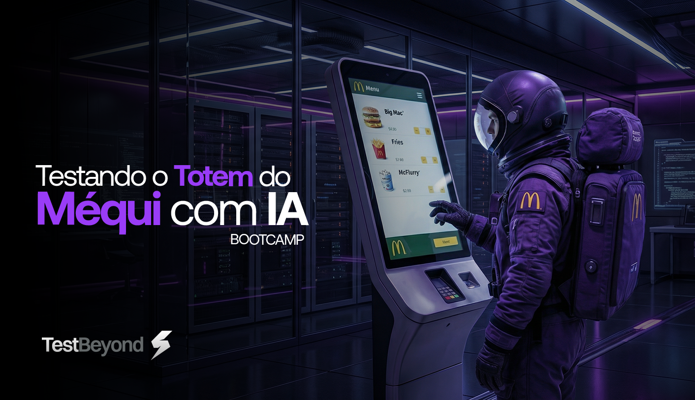

<div align="center">

**Sistema de Totem Interativo para Restaurantes**

[](https://vitejs.dev/)
[](https://react.dev/)
[](https://www.typescriptlang.org/)
[](https://supabase.com/)
[](https://opensource.org/licenses/MIT)

</div>

# 🍔🐞 McBugs

## 📖 Sobre o Projeto

O **McBugs** é um sistema completo de totem de autoatendimento desenvolvido exclusivamente para o curso **"Testando o Totem do Méqui com IA"**. O projeto simula a experiência real de um totem do McDonald's, oferecendo uma interface moderna e intuitiva para pedidos em restaurantes.

---

## 🛠️ Stack Tecnológica

### Core

- **[Vite](https://vitejs.dev/)** - Build tool ultrarrápido para desenvolvimento moderno
- **[React 18](https://react.dev/)** - Biblioteca UI com recursos modernos
- **[TypeScript](https://www.typescriptlang.org/)** - Type-safety e melhor DX

### Backend & Database

- **[Supabase](https://supabase.com/)** - Backend as a Service com PostgreSQL
- **[PostgreSQL](https://www.postgresql.org/)** - Banco de dados relacional robusto

---

## 📋 Pré-requisitos

Certifique-se de ter instalado:

- **Node.js** ≥ 18.0.0 ([Download](https://nodejs.org/))
- **Yarn** ≥ 1.22.0 ([Download](https://yarnpkg.com/))
- **Git** ([Download](https://git-scm.com/))
- Conta no **[Supabase](https://supabase.com)** (para banco de dados)

---

## 🚀 Guia de Instalação

### 1️⃣ Clone o Repositório

```bash
git clone <url-do-seu-repositorio>
cd mcbugs-order-hub
```

### 2️⃣ Instale as Dependências

```bash
yarn install
```

### 3️⃣ Configure as Variáveis de Ambiente

Crie um arquivo `.env.local` na raiz do projeto:

```env
VITE_SUPABASE_URL=https://seu-project-ref.supabase.co
VITE_SUPABASE_PUBLISHABLE_DEFAULT_KEY=sua-chave-publica-aqui
VITE_SUPABASE_PROJECT_ID=seu-project-ref
```

> 💡 **Dica:** Veja a seção [Configurar o Supabase](#️-configurar-o-supabase) para obter suas credenciais.

### 4️⃣ Inicie o Servidor de Desenvolvimento

```bash
yarn dev
```

🎉 **Pronto!** Acesse [http://localhost:8080](http://localhost:8080)

---

## ☁️ Configurar o Supabase

### Criar Projeto no Supabase

1. Acesse [https://supabase.com](https://supabase.com) e faça login
2. Clique em **"New Project"**
3. Preencha os dados:
   - **Name**: Nome do seu projeto (ex: `mcbugs-order-hub`)
   - **Database Password**: Crie uma senha forte e **anote-a**
   - **Region**: Escolha a região mais próxima
4. Clique em **"Create new project"** e aguarde a criação

### Obter Credenciais

1. No dashboard do Supabase, vá em **Settings** → **API**
2. Anote as seguintes informações:
   - **Project URL** (ex: `https://xxxxx.supabase.co`)
   - **anon/public key** (chave pública, começa com `eyJ...`)
   - **Project ID** (encontrado na URL: `https://supabase.com/dashboard/project/seu-project-id`)

### 🗄️ Executar Migrations

Você tem duas opções:

#### Opção A: Usando a CLI do Supabase (Recomendado)

```bash
# Instale a CLI do Supabase
yarn add supabase -D

# Faça login
yarn supabase login

# Link seu projeto (project-ref está na URL do dashboard)
yarn supabase link --project-ref seu-project-ref

# Execute as migrations
yarn supabase db push
```

#### Opção B: Usando o SQL Editor no Dashboard

1. No dashboard do Supabase, vá em **SQL Editor**
2. Clique em **"New query"**
3. Execute as migrations na ordem:
   - `supabase/migrations/20251209002507_9a9f0129-cc6b-4721-bcbc-5f53568415f9.sql`
   - `supabase/migrations/20251209010000_add_sequential_order_number.sql`

### ✅ Verificar Instalação

1. No **Table Editor**, verifique se a tabela `orders` foi criada
2. No **SQL Editor**, execute: `SELECT get_next_order_number();`

---

## 🔧 Comandos Úteis

```bash
# Desenvolvimento local
yarn dev

# Build local
yarn build

# Preview do build
yarn preview

# Executar migrations (com Supabase CLI)
yarn supabase db push

# Ver status do Supabase
yarn supabase status
```

---

## 📚 Documentação Útil

- [Documentação do Supabase](https://supabase.com/docs)
- [Documentação do Vite](https://vitejs.dev)

---

---

## Créditos

A aplicação base **McBugs** é material do curso *"Testando o Totem do Méqui com IA"*, de **[Fernando Papito](https://testbeyond.com)** / **Projeto TestBeyond**. Este repositório documenta meu trabalho de QA com Playwright, MCP e IA.

---

## 🇺🇸 English

Interactive self-service kiosk system (**McBugs**) that simulates a McDonald's-style restaurant ordering experience. This repository documents my QA work with **Playwright**, **MCP**, and **AI-assisted testing**.

### About the project

**McBugs** is a full-stack web app built with Vite, React, TypeScript, and Supabase. It includes end-to-end test automation for dine-in and takeaway flows, test case documentation, and AI prompts for QA workflows.

### Tech stack

- **Vite** — build tool
- **React 18** — UI
- **TypeScript** — type safety
- **Supabase** — backend and PostgreSQL database
- **Playwright** — E2E test automation

### Requirements

- Node.js ≥ 18.0.0
- Yarn ≥ 1.22.0
- Git
- Supabase account (for database)

### Quick start

```bash
git clone <your-repo-url>
cd myapp-playwright-mcp-with-ai
yarn install
```

Create a `.env.local` file with your Supabase credentials, then run:

```bash
yarn dev
```

Open [http://localhost:8080](http://localhost:8080).

### Credits

The base **McBugs** application is course material from *"Testando o Totem do Méqui com IA"* by **[Fernando Papito](https://testbeyond.com)** / **TestBeyond Project**. This repository documents my QA work with Playwright, MCP, and AI.
